# GoodshytGroup

**Trust-first systems across AI, security, hardware, automation, and developer tooling.**

  
  
  
  

  
  

---

## Overview

GoodshytGroup builds modular software systems focused on:

- **AI reasoning and judgment workflows**
- **secure infrastructure and policy-driven architecture**
- **hardware and human-machine interaction**
- **verification and analysis pipelines**
- **automation, developer tooling, and documentation systems**

The portfolio is centered on systems that are **explainable, resilient, structured, and practical to deploy**.

---

## What I build

- AI reasoning engines with evidence-based evaluation
- Secure service layers and trust-first architecture
- Human-machine interface systems and gesture tooling
- Verification, OSINT, and structured analysis pipelines
- Automation for publishing, scheduling, and workflow orchestration
- README systems, reusable templates, and developer experience tooling

---

## Tech stack

  

  
  
  
  
  
  

---

## Architecture map

```mermaid
flowchart TD
  A[GoodshytGroup] --> B[AI Reasoning]
  A --> C[Security Infrastructure]
  A --> D[Hardware + HMI]
  A --> E[Verification + Analysis]
  A --> F[Automation Pipelines]
  A --> G[Developer Tooling]

  B --> B1[Judgment Engines]
  B --> B2[Explainable Inference]
  B --> B3[Evidence Workflows]

  C --> C1[Policy Layers]
  C --> C2[Secure Services]
  C --> C3[Trust-First Systems]

  D --> D1[Gesture SDKs]
  D --> D2[Low-Latency Input]
  D --> D3[Hardware Adapters]

  E --> E1[Claim Verification]
  E --> E2[OSINT Pipelines]
  E --> E3[Structured Analysis]

  F --> F1[Publishing Automation]
  F --> F2[Workflow Orchestration]
  F --> F3[Operational Tooling]

  G --> G1[README Systems]
  G --> G2[Templates]
  G --> G3[Profile Components]
```

---

## Featured projects

---

## Current focus

- Building stronger reasoning workflows
- Improving secure-by-default service patterns
- Refining documentation systems and profile tooling
- Expanding automation across build, release, and publishing flows

---

## Currently building

<!--START_SECTION:currently_building-->
- Judgment and inference systems
- Security-first service tooling
- Better profile and README infrastructure
- Community-focused automation systems
<!--END_SECTION:currently_building-->

---

## Live signals

  
  

  

---

## Profile signals

  
  
  

---

## Engineering style

I like systems that are:

- modular
- explainable
- policy-aware
- testable
- reusable
- built to scale cleanly

Most projects are structured with clear boundaries between **core logic**, **policy**, **interfaces**, and **automation**.

---

## Connect

  

